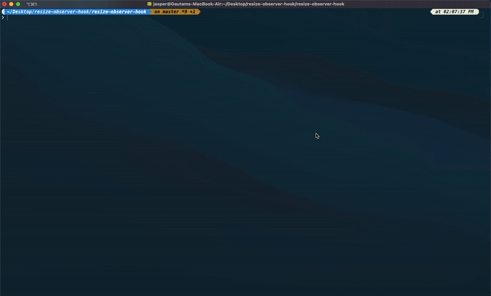

# nixty

A CLI tool that open files related to your git workflow on VS Code. Use `nix stage` command to open all the files that are present in your staging area. Use `nix recent` command to open files that were changed in the recent commit and use `nix commit <commitId>` to open files that were changed in a particular commit id.

 Note ⚠️ - Currently this package works only on UNIX/LINUX based systems.

<br/></br>
[](https://www.npmjs.com/package/resize-observer-hook)
[](https://www.npmjs.org/package/nixty)
[](https://standardjs.com)
[](https://github.com/Gautam-Arora24/nixty/issues)

<p align="center"></p>

---

## Install

```bash
npm install -g nixty
```

## Commands

`nix` is the name of the CLI that users will be using to type the commands.

### Open staged files 🙌🏻

    Open all the staged files (if present).

    nix stage

### Open committed files 🤘🏻

    Open files that were committed in a particular commit hash.

    nix commit <commit-id>

    Note ⚠️ - <commit id> is a required argument which must be provided while running the above command.

### Open recent files ✌🏻

    Open files that were committed in the recent commit.

    nix recent

## Contributing

[You can help this library to grow by contributing here](https://github.com/Gautam-Arora24/nixty/issues). Pick any issue or open one. Let us know what you are working on and ask your questions in the issues itself :)

The package is made up of 2 main folders:

```
- src contains the main logic and code for the library.
- bin
    -> index.js // entry point for the library.
```

To setup and run a local copy:

1.  Clone this repo with `https://github.com/Gautam-Arora24/nixty.git`
2.  Run `npm install -g .` in the root folder to make the CLI available globally.

When you're done working on your changes, submit a PR with the details of the current changed code.

## License

ISC © [Gautam-Arora24](https://github.com/Gautam-Arora24),
